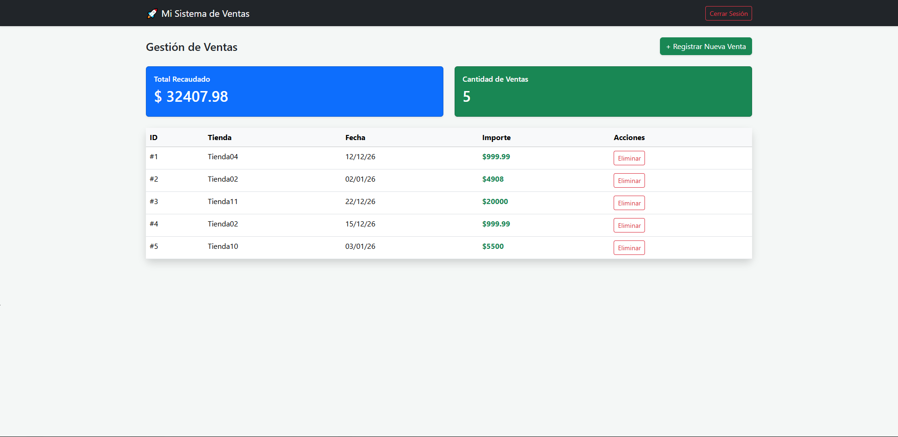
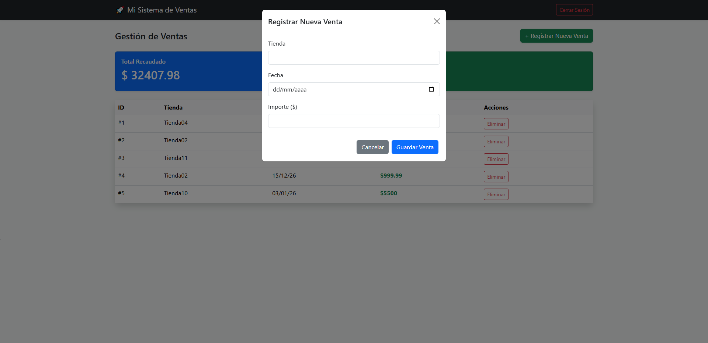

# 🚀 Sistema de Gestión de Ventas

Este es un proyecto profesional desarrollado con **FastAPI** y **Bootstrap 5**. Permite gestionar ventas en tiempo real con autenticación de usuarios.

## ✨ Características
- **Autenticación:** Login seguro con JWT (JSON Web Tokens).
- **CRUD Completo:** Registro, visualización y eliminación de ventas.
- **Backend:** API REST construida con Python y SQLAlchemy.
- **Frontend:** Dashboard dinámico y responsive.

## 🛠️ Tecnologías
- **Backend:** Python, FastAPI, SQLite.
- **Frontend:** HTML, CSS, JavaScript, Bootstrap 5.
- **Despliegue:** Render.

## 📸 Captura

